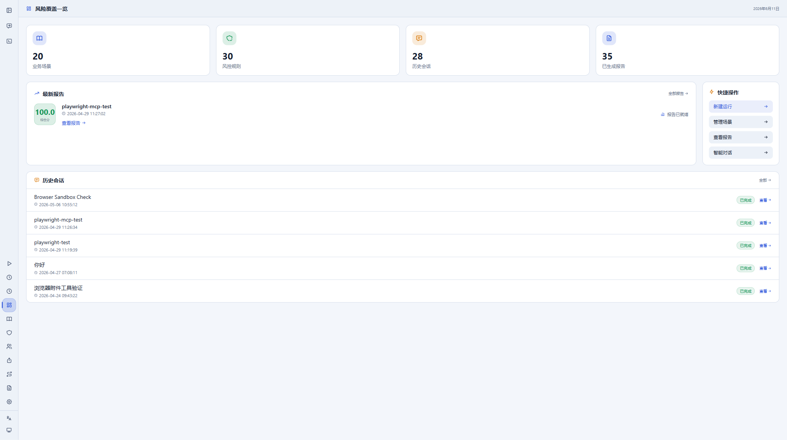

# Risk Agent

Risk Agent is a local-first risk-control analysis workspace. It combines a
Coordinator + Worker agent loop, structured risk rules, knowledge and lineage
views, streaming chat, an operator workbench, and a browser-assisted tool layer
for investigating business risk scenarios.



## What It Does

- Builds risk-analysis runs from scenarios, rules, reports, sessions, and
  browser context.
- Streams agent progress through Fastify REST APIs and WebSocket events.
- Provides a React dashboard, chat surface, run workbench, reports, settings,
  storage controls, MCP management, and embedded browser workspace.
- Supports OpenAI-compatible, Anthropic-compatible, and local model providers
  through configurable model profiles.
- Stores local runtime state under `risk_agent_data/`, keeping source code and
  private data separate.
- Includes Electron packaging and Docker deployment scaffolding for desktop or
  service-hosted usage.

## Repository Layout

```text
packages/core       Agent runtime, tools, task packs, storage, LLM providers
packages/server     Fastify API, WebSocket events, schedulers, run services
packages/web        React + Vite operator console
packages/desktop    Electron shell and desktop packaging entry points
config              Example app, model, MCP, and data-source configuration
docker              Compose and nginx deployment helpers
services            Optional Python sidecar service
scripts             Development, build, and packaging scripts
test                Shared test and verification assets
```

The public repository intentionally excludes the full internal `docs/` tree and
local runtime data. This README is therefore self-contained for public setup and
operation.

## Requirements

- Node.js 24 LTS
- pnpm 9
- Windows, macOS, or Linux for web/server development
- Optional: Docker for container deployment
- Optional: Electron build toolchain for desktop packaging

Enable pnpm through Corepack if needed:

```bash
corepack enable
corepack prepare pnpm@9.0.0 --activate
```

## Quick Start

```bash
pnpm install
pnpm dev
```

The default development entry starts:

- API server: `http://127.0.0.1:8787`
- Web app: `http://127.0.0.1:5173`
- Playwright MCP sidecar: `http://localhost:8931/mcp`

Open the web app and use the Settings pages to configure model providers,
storage, MCP servers, data sources, browser runtime, and security preferences.

## Common Commands

```bash
pnpm dev                         # Server + web + Playwright MCP sidecar
pnpm dev:server                  # Fastify server only
pnpm dev:web                     # Vite web app only
pnpm dev:desktop                 # Desktop dev entry
pnpm typecheck                   # TypeScript project references
pnpm lint                        # ESLint over package source
pnpm test                        # Vitest workspace
pnpm build                       # Build all packages
pnpm build:web                   # Build web package
pnpm build:server                # Build server package
pnpm package:desktop:portable    # Build desktop portable artifact
```

## Configuration

Copy the example environment file and fill only the providers you need:

```bash
cp .env.example .env
```

Important variables:

```text
OPENAI_API_KEY=                  OpenAI-compatible fallback key
OPENAI_BASE_URL=https://api.openai.com/v1
ANTHROPIC_API_KEY=               Anthropic-compatible fallback key
ANTHROPIC_BASE_URL=https://api.anthropic.com
OLLAMA_BASE_URL=http://localhost:11434
RISK_AGENT_PORT=8787
RISK_AGENT_HOST=127.0.0.1
RISK_AGENT_DATA_DIR=             Optional runtime data directory override
LOG_LEVEL=info
```

Runtime settings can also be managed from the web UI. Do not commit `.env`,
`risk_agent_data/`, generated databases, logs, model keys, provider tokens, or
session attachments.

## Data And Storage

Risk Agent defaults to embedded local storage:

- SQLite for structured records
- LanceDB for vector data
- Graphology-backed graph files
- Local object storage for attachments

By default, runtime data lives in `risk_agent_data/` at the repository or
configured executable level. To run a clean isolated instance:

```bash
RISK_AGENT_DATA_DIR=/path/to/private/data pnpm dev
```

On Windows PowerShell:

```powershell
$env:RISK_AGENT_DATA_DIR="D:\private\risk-agent-data"
pnpm dev
```

## Model Providers

Model providers can be configured through the Settings UI or environment
fallbacks. The runtime supports:

- OpenAI-compatible chat and streaming APIs
- Anthropic-compatible APIs with prompt-cache accounting
- Ollama-compatible local endpoints
- Per-model max token, temperature, priority, and enabled-state settings

Secrets are read from secure local configuration or environment variables and
are masked before being returned to the browser.

## Browser And MCP Tooling

The development entry starts a Playwright MCP sidecar on port `8931`. The server
can register MCP endpoints, refresh tool catalogs, run health checks, and route
tool calls through the operator interface.

Interactive browser verification should be done through the MCP/browser tooling
rather than a separate end-to-end test runner.

## Desktop And Deployment

Build package artifacts with:

```bash
pnpm build
pnpm package:desktop:portable
```

The Windows portable command writes its executable under
`tmp/npm-desktop-stage-*/release`. Native macOS and Linux distribution commands
write DMG/ZIP or AppImage/DEB files under `packages/desktop/release`. The desktop
release workflow instead creates a frozen hoisted production stage under
`tmp/npm-desktop-stage-*/release` on every native runner, validates the packaged
runtime, and fails when a job produces no supported installer.

For service deployment, use the Compose and nginx examples in `docker/` as a
starting point. Keep production secrets in your platform secret manager or
environment, never in committed JSON or env files.

## Public Release Hygiene

This public snapshot excludes:

- `docs/`
- `risk_agent_data/`
- `packages/server/risk_agent_data/`
- generated databases, logs, attachments, and temporary screenshots
- local agent caches and browser automation temp files

Before publishing, run a secret scan over tracked source files and confirm that
only placeholders such as `your-token`, `${env.NAME}`, or empty key fields are
present.

## Verification

Recommended local verification before a release:

```bash
pnpm typecheck
pnpm lint
pnpm test
pnpm build
```

For UI behavior, start `pnpm dev`, open the browser through MCP tooling, inspect
the page from top to bottom, and capture screenshots for release notes or README
updates when relevant.

## License

No license file is included in this snapshot. Add one before using the project
as a redistributable open-source dependency.
